# Scientific_Networking

## Background

The goal of this project is to understand the penetration of publications and what drives scientific relevance.

The citation data was extracted from DBLP, ACM, MAG (Microsoft Academic Graph), and other sources. It is available on this [website](https://www.aminer.org/citation). 
The version used was the 13th version. It contains 5,354,309 papers and 48,227,950 citation relationships. Each paper is associated with abstract, authors, year, venue, and title.

The data set can be downloaded directly [here](https://originalstatic.aminer.cn/misc/dblp.v13.7z).

## Data Pipeline

The data is provided in a JSON format. However, due to some original data errors such as irregular commas and null json rows, the data cannot be loaded in directly into Spark or Pandas without additional cleaning. This is addressed through the Json_File_Corrector.py.

These original errors pushed my first approach to a simplier method using File Open and manually changing each line into a workable Pandas DataFrame. Due to the size of the file and limitations with Memory, this limited my scope to the first 1.5 million publications. 

The DataFrame had sublists and subdictionaries that had key information about the authors, publishers, keywords. I created methods that extracted that information and simplified the DataFrame. There were rows where the year and author were not available along with errant details like impossible year or 'null' authors, venues and keywords. These rows were removed.

The data was split into two distinct DataFrames. One with 0 citations and one with 10 or more citations. The reason for this is that I wanted to investigate non-penetrating citations (i.e. 0 citations) as well as relevant citations (>= 10 citations). The selected threshold of 10 citations is currently standard practice for relevant articles.

## Questions

Starting off with some basic questions about the data

### General Data
* Amount of journal releases over the number of years
* Citation Distribution?
* How much has no or negligible citations (i.e. low impact journals)?
    * This would assume either 0 citations and/or no author
    * What percentage is this of total?
* Of the non-penetrating citations - who are the top publishers?
    * Look at Authors and Venues
    * Do they have a common area or tend to use a specific keyword?

###  Focused Data  
* Limit the citations to be something considered influential. 10 or more citations is considered to be solid.
    * Check the distribution of citations. It should be heavily focused to one-side
* What are the top ten venues, authors and keywords?
* Of the Top 10 everything - what is the distribution of citations for each?
* Is there a difference between the #1 and #10 source? What about #5 and #10?
    * Repeat for each venue, authors, keywords
* Is there a statistically significant difference between the #1 venue and #1 author?

## Initial EDA

### General Information

This chart shows the distribution of all the publications over the years. 

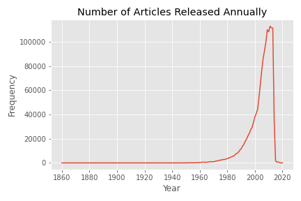

This shows it is heavily concentrated in the mid-2000s and where the majority of the data is originated from and what we can refer to. 

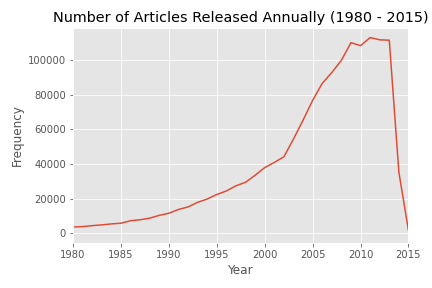 

The limitation of this dataset stems from the fact it pulls publications from data science and computer science publication databases. Since this is a growing field that made major in-roads with the mainstream adoption of computers coupled with massive improvements in computing efficiency, the initial publication rates make sense. The drop off in 2015 onward may be due to the fact I was unable to load all of the dataset or that the authors and publishers have made it more difficult to pull this information. 

Delving into the citations was a bit more illuminating. The graph and chart below showcase how many publication had x number of citations and how the distribution panned out.  While not unexpected, roughly 60% of all publications had less than 10 citations. 18 % of which had 0 citations.

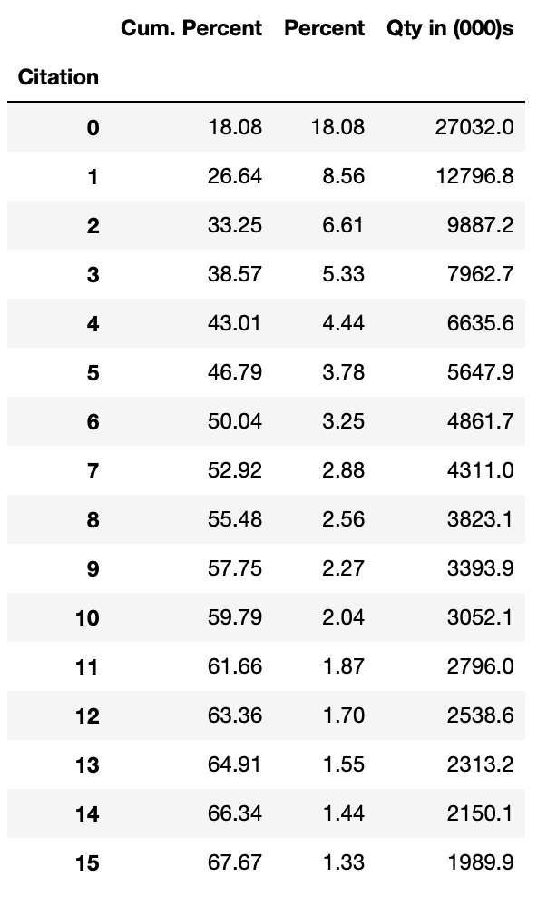 &nbsp; 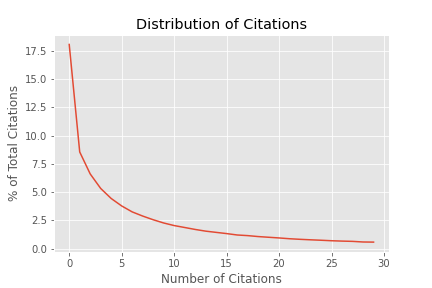

For authors, it was more biased towards having three or fewer authors which captured more than 75% of the group. Roughly 21% was an individual contributor and over 30% had two.

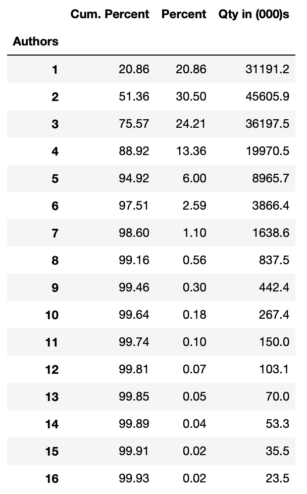 &nbsp; 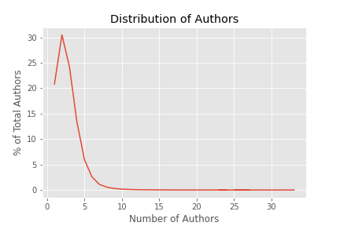

### Non-Influential Publications

Looking at the distribution and frequency of the most popular first authors, last authors, venues and keywords, I initially focused on the 0 citations to see if there were an interesting trends

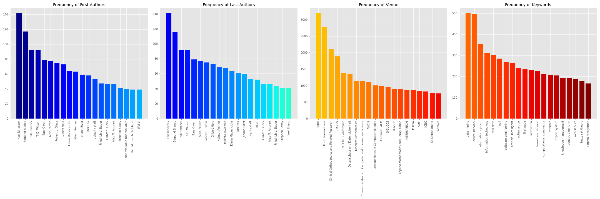

From what is shown Karl Rihaczek is one of the most prolific. Most of the authors were both the first and last author signifiying that they were the only author coupled with most of their publications were limited to one venue. CoRR, IEICE and Clinical Orthopaedics and Related Research are top locations for submissions. The first is a repository shared by several research institutes like Cornell, Stanford, etc while IEICE is a Japanese institute specializing in electronics, information and communication engineering. The bias, as expected is towards data science and communication research.

A lot of the publications occured in repositories, journals and research institutes which specialized in Artificial Inteligence and Communications which line up with some of the most common keywords (Data Mining, Neural Networks and Informational Technologies)

One of the common venues was Praxis der Informationsverarbeitung und Kommunikation (Information Processing and Communication Practice). An interesting note is that it ceased running in 2016.

When expanding to include all the groups that had less than 10 citations, the group expanded to include researchers like Wei Li, Wei Wang, and Makoto Takizawa but did not change drastically. The frequency of the data mining and neural networks increased even further and the key venues did not differ significantly.

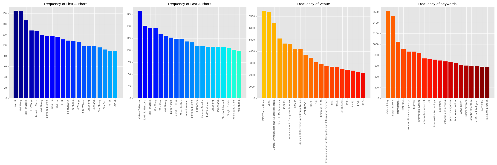

Some other key information were that there were 1500001 total entries. Of those, 1499718 have release year was noted between 1500 and 2020. (0.02% removal)

Of those 1486243 had a citation count and an author. ~ 99.1% is still usable. (0.9% removal)

There are 1245030 publications with keywords notated, roughly 16.23% have no keywords

### Influential Publications

Focusing on the more influential publications (# of citations >= 10). Most of the non-influential papers authors and venues tended to drop off, other than in a few cases such as Authors like Wei Wang and Wei Li or venues such as Clinical Orthopaedics and Related Research. What was interesting is that first keyword still remained data mining and neural networks which highlights all the interest and research efforts centered in this area. The most influential authors tended to submit to a multitude of journals and have more authors that would lend credence. For e.g. Thomas S. Huang submitted to over 80 different publishers with a at least 2 authors in each publication.

## Key Insights 

### Non-Influential Articles

* Almost all publications with 0 citations are with only one author.
* Publications with negligble keywords tend to get 0 citations.
* Most authors submitted to one journal/ group - if submit to other areas, its only a one off.
* 75% of all submissions have 3 or fewer authors

### Influential Articles

* Publications had more than one author
* Publications were submitted to a variety of sources
* Most keywords remained the same.

## Hypothesis Testing

#### Null Hypothesis: There is no intergroup difference between all the most prolific Authors, Venues or Keywords

#### Alternate Hypothesis: There is an intergroup difference between the Authors, Venues or Keywords. 

Note: Each Hypothesis is independent of one another and will run with an alpha of 0.05. Since this is testing the same data several times, a bonferroni correction will apply. Since each one checks one another ten times, the new alpha will be 0.005.

### Results

#### Intergroup Reference for First Author
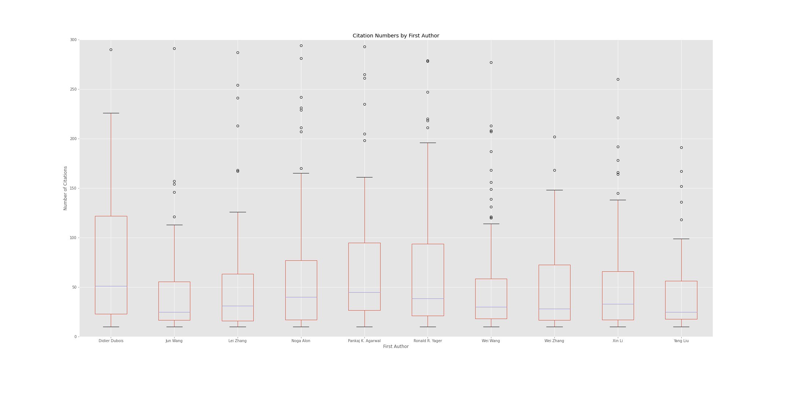
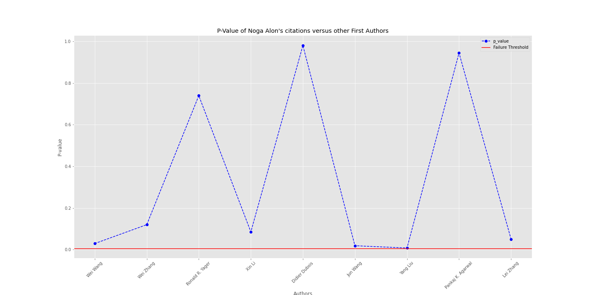

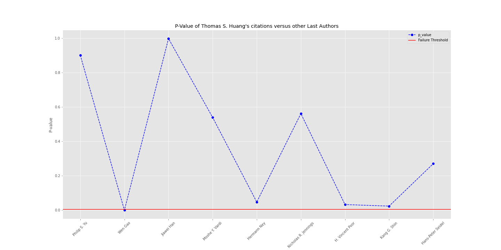

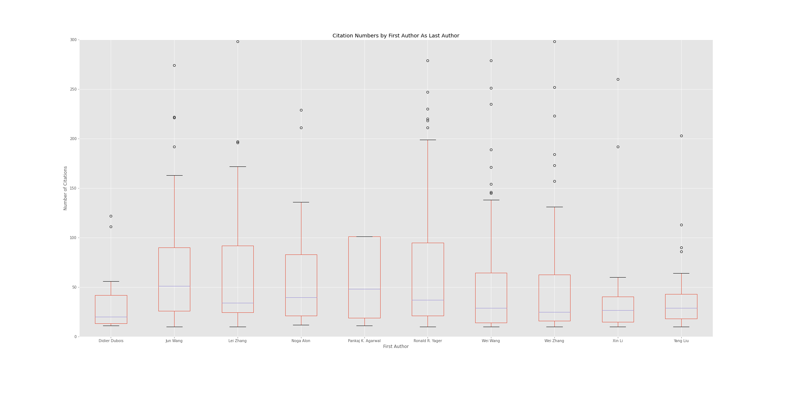
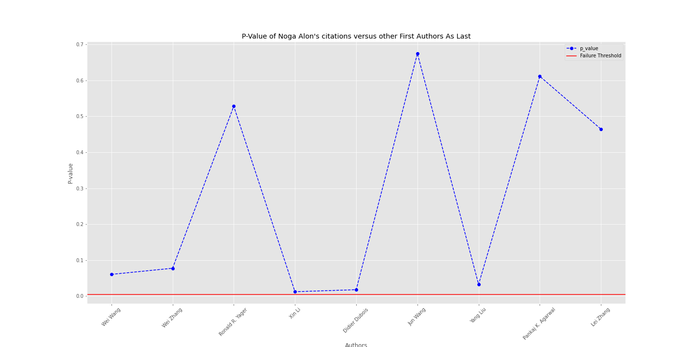

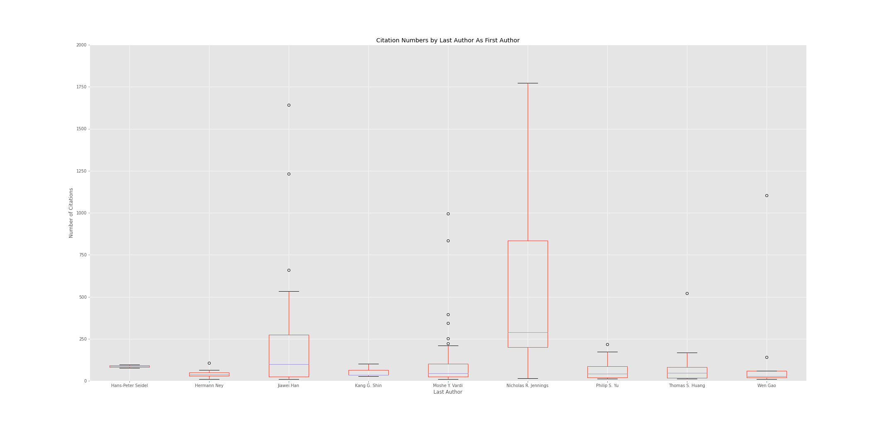
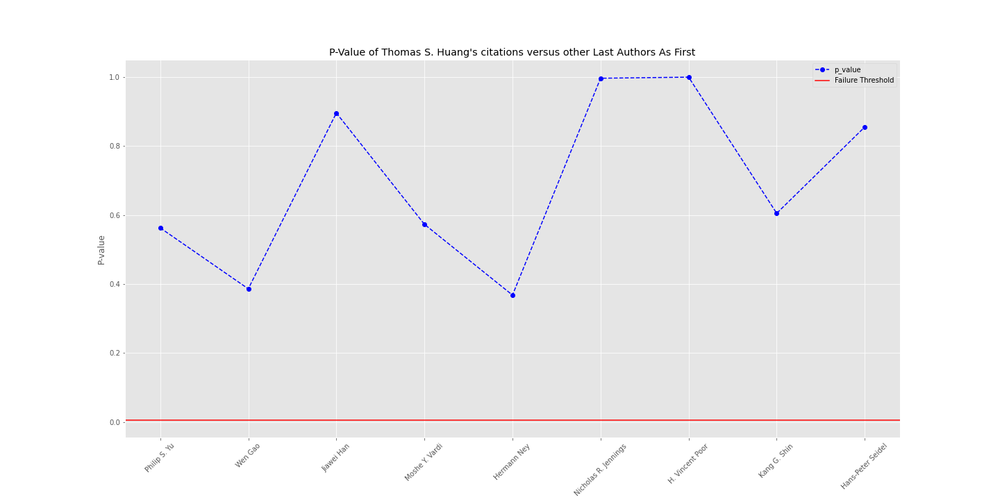

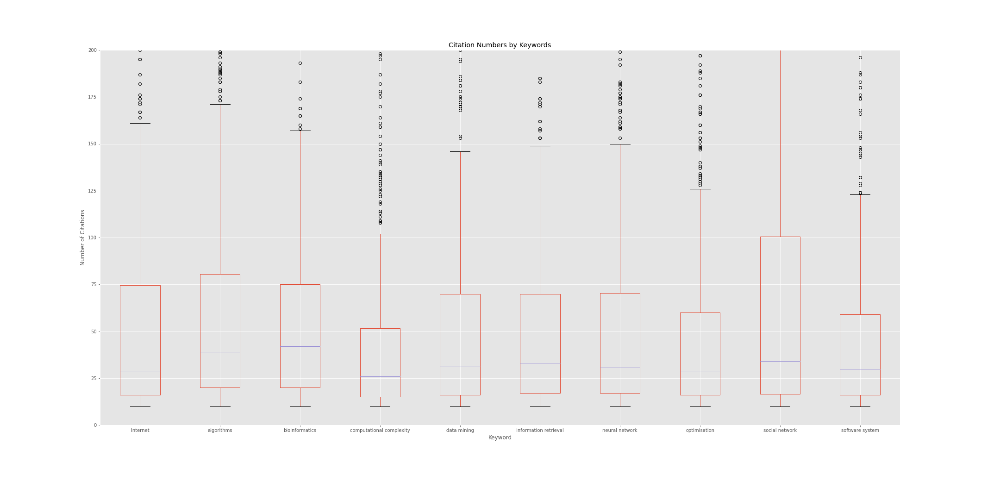
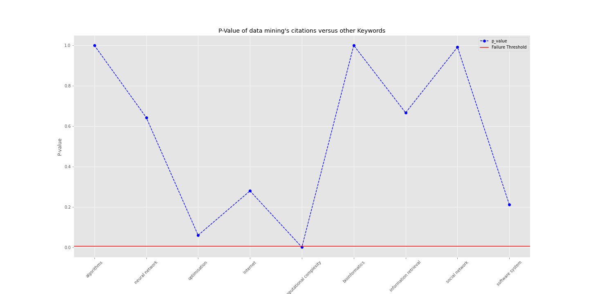

### Is there a difference between the most prolific Author and prolific Venue?

#### Null Hypothesis: There is no difference between all the most prolific Author and Venue

#### Alternate Hypothesis: There is an intragroup difference between the Author and Venue

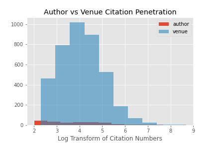
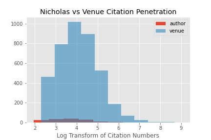

## Conclusions

1. The keyword failed to reject the null hypothesis in most cases. We can conclude there is no stat. sig. difference in keywords aside from computation complexity.
2. The last author failed to reject the null hypothesis in most cases except for 1. This means the most profilic last authors have no stat. sign. impact on # of citations other than vs Saharon.
3. The most prolific venue did have multiple significant difference where it is greater. Only BMC Informatics have similar penetration.

Assuming number of citations indicates it penetration in the scientific community

## Diving Deeper

### We would like to see if there is truly a difference between the most prolific Author and prolific Venue.

#### Null Hypothesis: There is no difference between all the most prolific Author and Venue

#### Alternate Hypothesis: There is an intragroup difference between the Author and Venue
##### Alpha is 0.05

